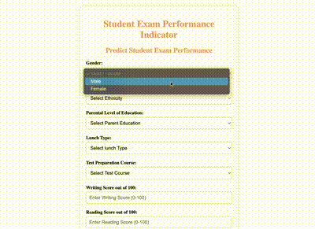

## End to end machine learning project: Predicting the score of students: 

Deploying a web application that predict the score of students in the service Cloud AWS.

0. Demo:

1. EDA and Feature selection: 

 The notebook 'notebook/1 . EDA STUDENT PERFORMANCE .ipynb' contains:

 - Data Collection 
 - EDA 
 - Features selection 

 2. Creating a pipeline to ingest, transform data and train the model

 3. Developing the front end of the application with Flask

 4. Creating an image Docker of the Flask application and then deploying it on the service cloud AWS.
